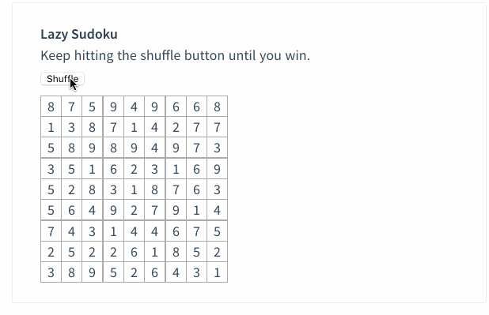
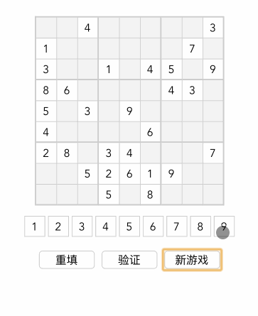
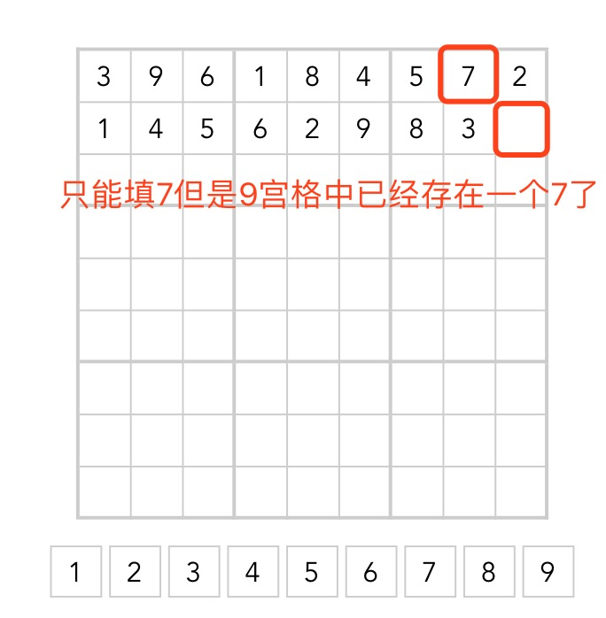
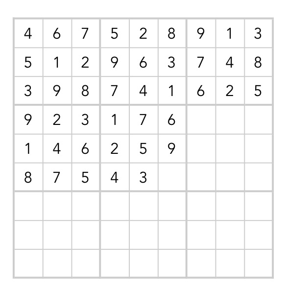
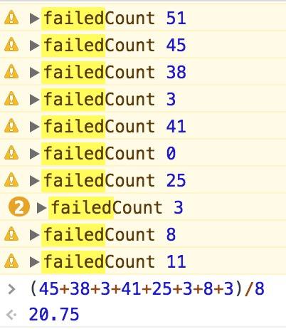
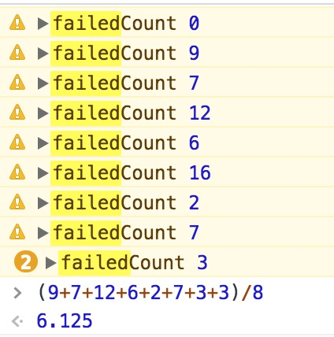

# vue-sudoku

> 一个使用vueJs实现的数独游戏。。

## Build Setup

``` bash
# install dependencies
npm install

# serve with hot reload at localhost:8080
npm run dev

# build for production with minification
npm run build
```

## 起因：
最近看到一篇相关的博文[用vue开发一个所谓的数独](https://juejin.im/post/5a3b02026fb9a0451a7689fd)。

## 前言：
前段时间在学习vue框架时看到官网示例中有这么个栗子



咋样是不是很酷炫，看到这个顿时按耐不住一颗程序员的心，然后花了2、3个晚上的时间写了个大概。。



怎么样是不是感觉（完全没有）掌握到精髓。。。

恩好吧，虽然我们长得丑但基本功能还是有的，在编码过程发现其实他的主要难度都在算法上


## 规则
在分析具体代码之前先明确一下数独的规则：

数独是源自18世纪瑞士的一种数学游戏。是一种运用纸、笔进行演算的逻辑游戏。玩家需要根据9×9盘面上的已知数字，推理出所有剩余空格的数字，并满足每一行、每一列、每一个粗线宫（3*3）内的数字均含1-9，不重复。

## 思路

要实现这个游戏，我的想法是先生成一个完整的符合规则的数组再将其中的一些值隐去。在验证时把填入的值和隐去的值作比较，如果相同就算正确，如果不一样在按规则做一次校验（考虑到可能有多种解法）。

## 实现步骤
1. 数据结构

    实现这个9*9宫格应该大家想的都差不多，用一个二维数组去对应每一个的数据。每个数据中包含一些属性用来表识具体的状态（正确、错误等）具体可在class文件中查看

    ```
    initGridList() {
        this.gridList = [];

        //生成大体布局
        for (let i = 0; i < this.ROWS; i++) {
            let rowList = [];
            for (let j = 0; j < this.COLS; j++) {
                let data = new Grid();
                rowList.push(data);
            }
            this.gridList.push(rowList);
        }

        return this.gridList;

    };
    ```

2. 向这个二维数组中插值（重点）

    在我们想这个二维数组中填值时要考虑数独的3个规则：

    1. 行不重复
    2. 列不重复
    3. 每个小9宫格不重复

    我们可以按照这3个要求来生成3个数组分别满足对应的要求的数组即
    ```
    let unUseRowList = this.getNoRepeatData(row, col, 1); //1.行不能重复
    let unUseColList = this.getNoRepeatData(row, col, 2); //2.列不能重复
    let unUseGroupList = this.getNoRepeatData(row, col, 3); //3.9宫格不能重复
    ```
    然后取这三个数组的交集，即是可插入的值的数组，然后从这数组中随机取个值插入即可。

    相关生成数组的代码：
    ```
    getNoRepeatData(row, col, type) {

        let baseDataList = this.baseDataList;

        //1.每行不能重复
        //2.每列不能重复
        //3.每个9宫格不能重复
        if (type === 1) {
            //筛选出有值的对象
            // debugger
            let exitDataList = this.gridList[row].filter((item, i) => {
                if (item && i !== col)
                    return item["text"];
            });

            return this.getUnUseDataList(exitDataList, baseDataList);
        } else if (type === 2) {
            let colDataList = this.gridList.map(item => {
                return (item.filter((subItem, index) => {
                    return index === col;
                }))[0]
            });
            //筛选出有值的对象
            let exitDataList = colDataList.filter((item, i) => {
                if (item && i !== row)
                    return item["text"];
            });

            return this.getUnUseDataList(exitDataList, baseDataList);
        } else if (type === 3) {
            let rowRange = [(row / 3 | 0) * 3, (row / 3 | 0) * 3 + 3];
            let colRange = [(col / 3 | 0) * 3, (col / 3 | 0) * 3 + 3];
            // console.log(rowRange, colRange);

            let exitDataList = [];

            for (let i = rowRange[0]; i < rowRange[1]; i++) {
                for (let j = colRange[0]; j < colRange[1]; j++) {
                    let item = this.gridList[i][j];
                    if (item && (i !== row || j !== col))
                        exitDataList.push(item);
                }
            }
            // console.log(exitDataList);

            return this.getUnUseDataList(exitDataList, baseDataList);

        }

    };

    ```


    ok接下来我们就可以试着生成标准答案了。

    ...loading...

    DuangDuangDuang啥只生成了两行数据就结束了。
    再试一次变3行了，再试还是两行。。

    仔细研究下发现生成了一定数据之后，确实会出现没有数据可生成的情况。。
    例如：
    

    恩，我试着换一种生成顺序：按9宫格来生成看看能不能提高成功率

    

    恩，数字是多了点，试着循环了100次成功了1次，成功率1%。。（中间还试了下先从四个角上和中间的9宫格开始生成，再生成其他格子的，虽然生成的数字会多一点但成功率还是差不多）

    看来还是得从根源上解决问题。

    回想我们生成值的时候是从多个可选值中选取一个插入，这个可选值会逐渐减少，直到一个值都没有。
    所以当我们没有值可取的时候可以考虑做一个回退，退到上一步去选择一另一个值，那我们这一步的可选值就有可能增加。（有点像蝴蝶效应）

    ```
    addCacheData(i, j, validData) {
        this.beforeGridDataList.unshift({row: i, col: j, validData});
        if (this.beforeGridDataList.length > this.cacheLength) {
            this.beforeGridDataList.length = this.cacheLength;

        }
        // console.log("this.beforeGridDataList", JSON.parse(JSON.stringify(this.beforeGridDataList)))

    };

    rollBack() {

        if (this.beforeGridDataList.length > 0) {
            // console.warn("rollBack", JSON.parse(JSON.stringify(this.beforeGridDataList)))
            // 从上一步的可选值里取一个
            let beforeGridData = this.beforeGridDataList.shift();

            let beforeValidList = beforeGridData.validData.list;

            if (beforeValidList.length > 0) {
                let data = beforeValidList[common.getRandom(beforeValidList.length)];
                beforeValidList.splice(beforeValidList.indexOf(data), 1);
                return {
                    row: beforeGridData.row,
                    col: beforeGridData.col,
                    validData: {data, list: beforeValidList}
                }

            } else {
                return this.rollBack();

            }
        } else {
            return null;
        }
    };
    ```
    上述代码中创建了一个cache数组储存上次的可选值，如果哪一步没有值可以生成了就去上一步找，再没有就再向上，直到找到后从那一步重新开始生成。

    我们如果把这个cache数组的长度设为3，试一下成功率
    
    测试10次去掉最高最低值，生成一张地图平均20.75次

    如果设置成6
    
    恩平均6.125次，已经是可接受的值了(在往上设置的话发现影响并不大，而且对性能的影响可能远大过成功率的提升，所以这个长度默认设了6)

    至此生成数据已经差不多了，但考虑到可能有些特殊情况还是会生成超过20次，所以我预先存了几个生成成功的数据，当失败次数大于20次的时候会直接去取这些数据。

3. 隐藏掉一些数据

    这步比较简单直接贴代码
    ```
    _hideSomeGridData(){
        for (let i = 0; i < 9; i++) {
            let rowList = [];
            let hideCount = common.getRandom(...this.level.hideGridRange);
            for (let j = 0; j < hideCount; j++) {
                let unAvailableList = this.gridList[i].filter((item, index) => {
                    return !item.isAvailable;

                });
                unAvailableList[common.getRandom(unAvailableList.length)].isAvailable = true;

            }
            this.gridList.push(rowList);
        }
    },
    ```


## 以后要加的功能
第一点当然是改UI啦（苦笑），毕竟我要不说谁能知道当初我是像照着那个动效做的。。
其他的话应该会考虑增加一些难度级别，其实现在已经有了，就是还没加数据测试，可能回想做点不一样的。

比如说用图片做9宫格。。。


## 结语
恩本人技术水平有限，时间也比较仓促，写得不好的地方欢迎指出。代码已经上传到[github](https://github.com/ni742015/vue-sudoku)了：有需要的可以star一下！


